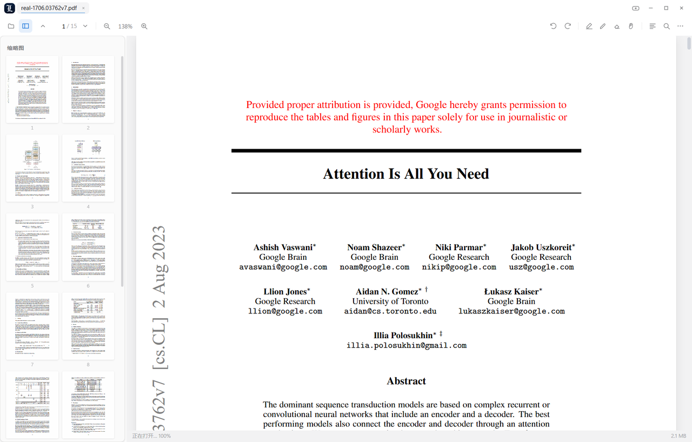
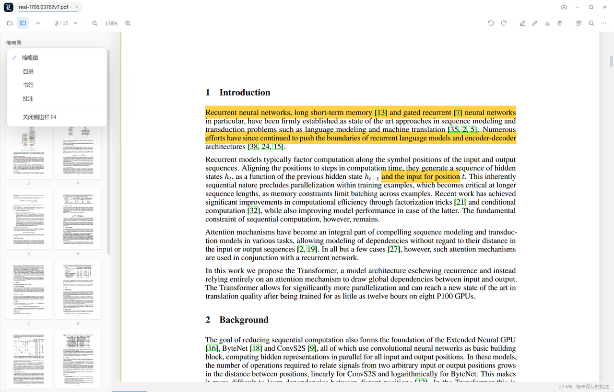
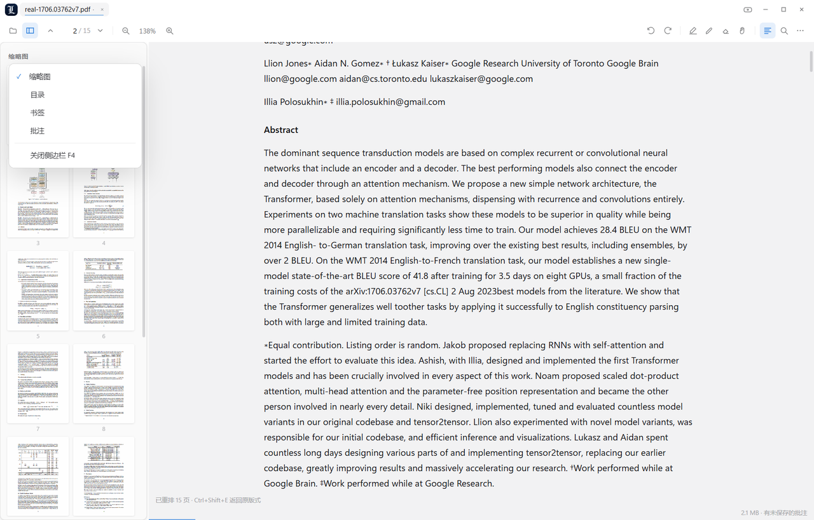
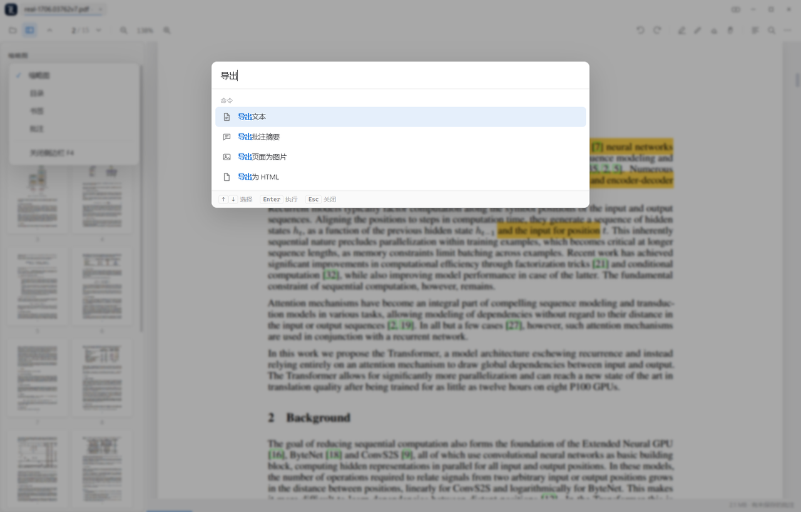
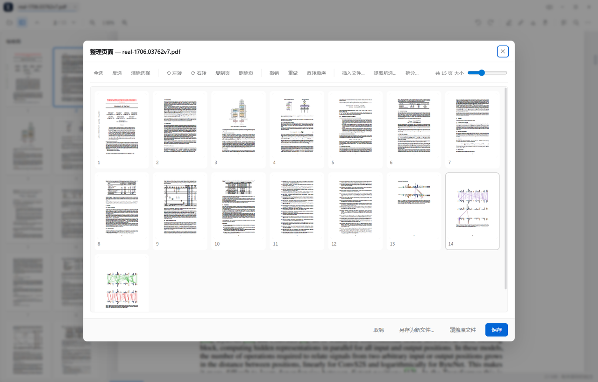
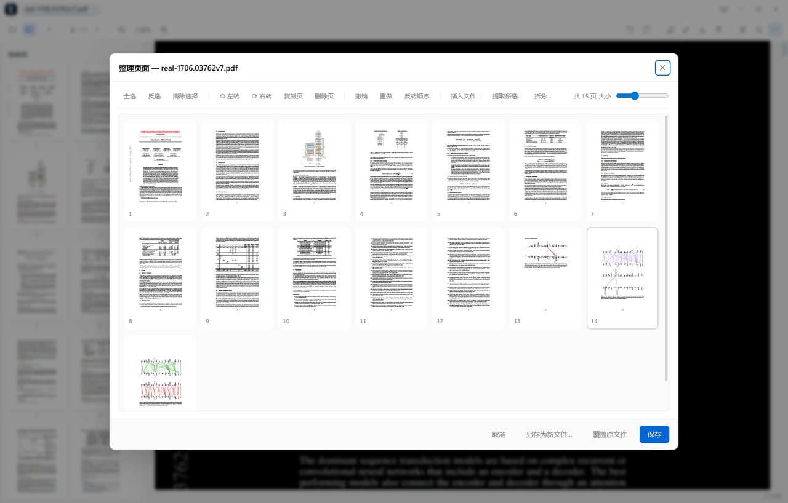
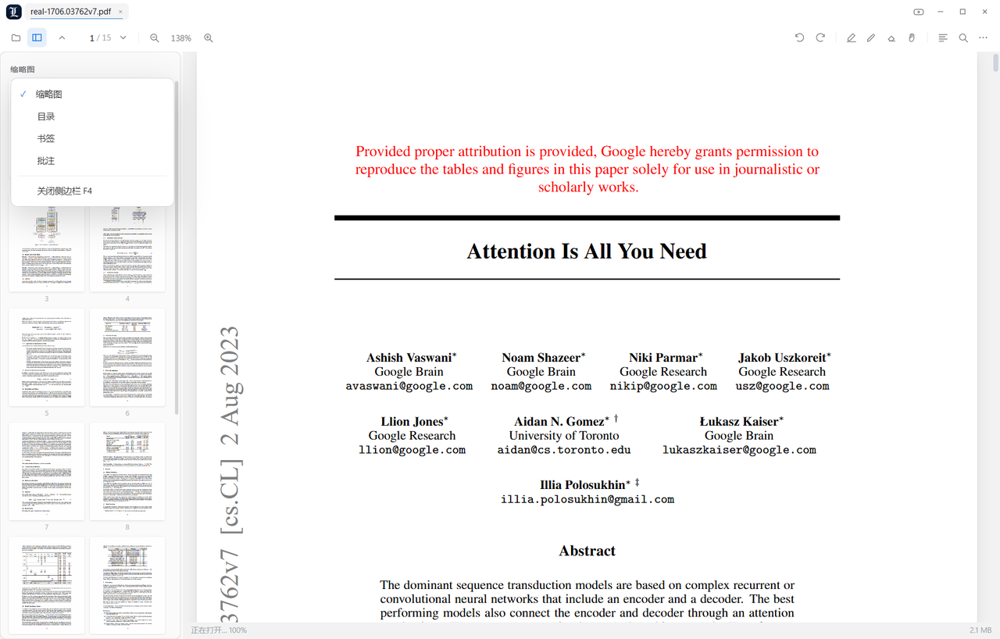
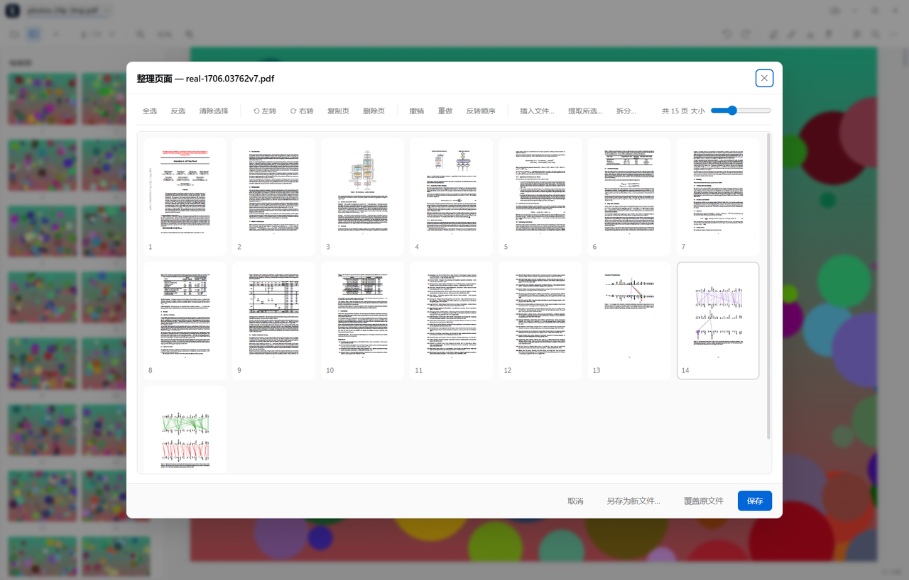

<div align="center">


# LeebertyPDF

**为 Windows 打造的本地 PDF 阅读器** — PDF.js 渲染内核 + 全自研界面
全文搜索 · 高亮批注 · 目录书签 · 夜间阅读 · 标签页 · 阅读进度记忆

[](https://github.com/leerogerstheman/LeebertyPDF/releases/latest)
[](#下载)
[](#实现要点)
[](LICENSE)

[下载](#下载) · [截图](#截图) · [功能](#功能) · [快捷键](#快捷键) · [从源码构建](#从源码构建)

</div>



## 下载

| 方式 | 怎么做 |
|---|---|
| **便携版（推荐）** | 到 [Releases](https://github.com/leerogerstheman/LeebertyPDF/releases/latest) 下载 `LeebertyPDF-*-portable-win-x64.zip`，解压到任意目录，双击 `LeebertyPDF.exe` 即可。绿色免安装。 |
| 安装版 | 解压后运行 `tools\install.ps1`：装到 `%LOCALAPPDATA%\Programs\LeebertyPDF`，建开始菜单与桌面快捷方式，并注册 `.pdf` 的「打开方式」。`-Uninstall` 可干净卸载。 |
| 从源码构建 | 见 [从源码构建](#从源码构建)，需要 Node.js 与 pnpm。 |

> 需要 Windows 10 / 11 (x64)。便携版约 330 MB —— 内含完整的 Electron/Chromium 运行时，
> 这也是它不依赖任何系统组件、解压即用的原因。所有数据只留在本机，不联网、不上传。

<details>
<summary>English</summary>

**LeebertyPDF** is a local-first PDF reader for Windows 10/11 (x64).
Rendering is Mozilla's **PDF.js 6.3**, wrapped in a hand-written UI and a from-scratch
object-level PDF engine (annotation editing, page operations, incremental save).

It reads and writes PDFs entirely offline — no account, no telemetry, no upload.
Highlights, ink, text boxes and signatures are written back into the file itself, so
annotations made here open correctly in Acrobat, Firefox and Preview.

Grab the portable zip from [Releases](https://github.com/leerogerstheman/LeebertyPDF/releases/latest),
unzip anywhere and run `LeebertyPDF.exe`. See [从源码构建](#从源码构建) to build it yourself.

</details>

## 截图

| 阅读 | 高亮批注 |
|---|---|
|  |  |

| 图文重排（单栏重排） | 命令面板（模糊搜索） |
|---|---|
|  |  |

| 页面整理（拖拽重排/旋转/删除/合并） | 夜间阅读 |
|---|---|
|  |  |

| 目录大纲 | 图像密集型 PDF |
|---|---|
|  |  |


---


> 安装位置：源码与便携版在 `D:\LeebertyPDF`，安装版在
> `%LOCALAPPDATA%\Programs\LeebertyPDF`，用户数据在 `%APPDATA%\LeebertyPDF`。
> 所有脚本都用自身位置推导项目根目录，整个文件夹可以整体改名或搬到别处。

## 从源码构建

仓库是**自包含的渲染部分**：PDF.js 6.3.289 已随源码提供
（`src/renderer/vendor/pdfjs/`，含为旧版 V8 注入的兼容垫片），
所以只需要自己补一份 Electron 运行时。

```powershell
# 1. 取 Electron 38.8.6 (win32-x64)，解压到 _vendor\electron\
#    下载 https://github.com/electron/electron/releases/download/v38.8.6/electron-v38.8.6-win32-x64.zip
#    解压后应存在  _vendor\electron\electron.exe
#    （_vendor\ 不入库：约 500 MB，且是可复现的第三方二进制）

# 2. 若替换过 PDF.js 上游文件，重新注入兼容垫片
powershell -ExecutionPolicy Bypass -File tools\sync-vendor.ps1

# 3. 生成测试用 PDF（samples\ 不入库，全部由脚本生成）
node tools\make-samples.js
python tools\make_image_samples.py

# 4. 编译启动器 + 构建便携版到 dist\
powershell -ExecutionPolicy Bypass -File tools\build.ps1

# 5. 安装到当前用户（可选）
powershell -ExecutionPolicy Bypass -File tools\install.ps1
```

开发时用 `tools\run.ps1 -Dev` 直接跑 `_vendor` 里的 Electron 并自动打开 DevTools：

```powershell
powershell -ExecutionPolicy Bypass -File tools\run.ps1 -Dev
powershell -ExecutionPolicy Bypass -File tools\run.ps1 -Dev -Files samples\sample-small.pdf
```

> `tools\run.ps1` 和 `LeebertyPDF.exe` 都会清掉 `ELECTRON_RUN_AS_NODE`。
> 这个变量一旦存在，Electron 会退化成纯 Node 进程，表现就是「双击没反应」。

## 项目状态

| 项目 | 结果 |
|---|---|
| PDF 引擎单测 | **20/20**（`tools\pdfeng-test.js`，纯 Node，不需要 Electron） |
| 功能体检 | **47/47**，0 控制台错误（`tools\featuretest.ps1`） |
| 界面自测 | **PASS**，无渲染层报错（`tools\test.ps1`） |
| 空白页探针 | **PASS**，可见页全部绘制（`tools\blankprobe.js`） |
| 图像大文件 | **5/5**，0 控制台错误（`tools\imgtest.ps1`） |
| 内存探针 | 分阶段记录堆/画布/DOM（`tools\memprobe.js`） |

## 名称与图标

产品名 **LeebertyPDF**：

- 窗口标题、任务栏、开始菜单/桌面快捷方式、安装目录
  （`%LOCALAPPDATA%\Programs\LeebertyPDF`）、用户数据目录
  （`%APPDATA%\LeebertyPDF`）、`.pdf` 打开方式（`LeebertyPDF.Document`）
  全部使用新名称；`tools\install.ps1` 会自动清理旧的 `LumenPDF` 安装与快捷方式。
- 图标是**深蓝渐变底 + 白色哥特体大写 L**，由 `python tools\make_icon.py`
  生成（Old English Text MT 字形，导出色含 16/24/32/48/64/128/256/512 与多尺寸 `icon.ico`）。
  顶栏的那枚小标记是同一图标的 18→22px 版本（内联为 data URI，任何目录布局都能显示）。
- 内部标识符有意保留原名，避免破坏兼容性：`lumen-file://` / `lumen-app://` 协议、
  `window.lumen` 预加载接口、`window.__lumenTest*` 测试钩子、`.lumen-flash` 等 CSS 类。
  它们是实现细节，不影响任何可见名称。

## 这是什么

`D:\LeebertyPDF` 是一个完整、可直接使用的 Windows 桌面 PDF 阅读器。渲染内核使用
Mozilla 官方的 **PDF.js 6.3.289**（与 Firefox 内置阅读器同源），界面、批注系统、
搜索面板、书签、阅读进度等全部本地实现。所有数据只保存在本机，不联网、不上传。

| | |
|---|---|
| 运行环境 | Windows 10 / 11 (x64)，无需安装任何依赖 |
| 运行时 | Electron 38 (Chromium 140) + PDF.js 6.3 |
| 体积 | 便携版约 330 MB（含 Chromium 运行时） |
| 数据目录 | `%APPDATA%\LeebertyPDF`（设置 / 阅读进度 / 书签 / 批注） |

## 快速开始

**双击 `LeebertyPDF.exe` 就能用。** 它是约 60 KB 的原生启动器（源码 `tools\launcher.cs`），
负责找到运行时、摆好参数、隐藏控制台，并转发文件参数：

- 自动识别目录布局 —— 便携目录用同级的 `electron.exe` + `resources\app`，
  开发目录用 `_vendor\electron\electron.exe` + 本目录；
- 清掉 `ELECTRON_RUN_AS_NODE` / `NODE_OPTIONS` / `LUMEN_*` 等会被 Electron
  误当成纯 Node 进程、或误开测试模式的环境变量；
- 配合单实例机制，再次双击 PDF 只在已有窗口里新开一个标签页；
- 带程序图标，失败时弹窗说明原因，而不是闪退。

把 PDF 拖进窗口，或在资源管理器里「打开方式 → LeebertyPDF」都可以；
也支持命令行：`LeebertyPDF.exe "C:\某文档.pdf"`。

### 安装版

```powershell
powershell -ExecutionPolicy Bypass -File tools\install.ps1
```

装到 `%LOCALAPPDATA%\Programs\LeebertyPDF`，创建开始菜单与桌面快捷方式，
并注册 `.pdf` 的「打开方式」条目。全程不需要管理员权限。
卸载：`tools\install.ps1 -Uninstall`（用户数据会保留在 `%APPDATA%\LeebertyPDF`）。

> Windows 不允许程序静默抢占默认程序，请在「打开方式」里手动选一次。

### 便携版

`dist\` 是自包含目录（运行时 + 应用本体），拷到 U 盘或别的电脑都能直接跑，
不写注册表、不装服务。重新构建：`tools\build.ps1`。

### 数据放在哪

| 内容 | 位置 |
|---|---|
| 设置、阅读进度、书签、批注 | `%APPDATA%\LeebertyPDF` |
| 程序本体（安装版） | `%LOCALAPPDATA%\Programs\LeebertyPDF` |
| 程序本体（便携版） | 解压出来的那个目录 |

删掉用户数据目录即可完全恢复出厂状态。所有数据只在本机，不联网。

## 橡皮擦与图文重排

### 独立橡皮擦（工具栏 ⌫ / `E`）

本版 PDF.js（6.3）没有橡皮擦模式，所以这个是**自己实现的**（`src/renderer/eraser.js`）：

- 切到橡皮擦后，会在页面之上铺一层透明的捕获层，鼠标移到批注上时会**描红框**指出将被擦除的对象；
- 单击立即擦除，按住拖动可以连续擦；
- 删除走的是 `annotationStorage.remove(id)`，因此**不依赖编辑器**：别的阅读器写入的批注、
  从未被打开成编辑器的批注，同样能擦掉；
- 存储条目与画面上节点的对应关系是**按几何配对**的（把批注的 `rect` 经页视口投影后与节点包围盒
  比对），而不是按顺序，所以 PDF.js 渲染的节点数与存储条目数不一致时也不会张冠李戴；
- 擦除后立刻重绘该页、刷新批注面板与状态栏。

### 图文重排（工具栏 ☰ / `Ctrl+Shift+E`）

把固定版式的页面变成**单栏可读流**（`src/renderer/reflow.js`）：

- 文字按位置还原成行、再按行距/字号变化合并成段落，标题自动加粗放大；
- 图片与矢量图按**阅读顺序**插回正文之间，而不是堆在末尾；
- 图片位置来自**页面操作符表**里 `transform` + `paintImageXObject` 的精确变换矩阵，
  矢量图则用低分辨率渲染的墨迹扫描兜底，两者重叠时以精确矩形为准；
- 图片**裁到实际墨迹**（image XObject 的绘制框通常比画面内容大，直接裁会带一片空白）；
- 字号 / 行距 / 栏宽 / 是否保留图片都在「设置 → 显示」里调，改档即时生效，无需重新提取；
- 重排结果可以选中复制，切回原版式是瞬时的（两套视图都保留着）。

实测（`tools\featureprobe.ps1`）：

| 项目 | 结果 |
|---|---|
| 橡皮擦 | 创建 2 处批注 → 命中 1 处擦除 → 剩 1 处；描红框正常；几何配对 2/2 |
| 重排（12 页文字样本） | 2.7 s 完成 12 页 → 60 段落 / 12 标题；字号 16→22px 即时生效；切回原版式正常 |
| 重排（12 页 × 24 图拼版） | 每页合并为 **1 张图**（此前会被切成 48 条），按阅读顺序插入 |


## 内存与交互打磨

### 内存：三处实测泄漏已修

用 `tools\memprobe.js`（`LUMEN_MEMPROBE=1`）分阶段量：JS 堆、画布背储、DOM 节点、
存活画布数、重排图形数。修复前后对比：

| 场景 | 修复前 | 修复后 |
|---|---|---|
| 重排视图渲染后（3 标签页） | 画布 **80.5 MB** | 画布 **58.6 MB**（↓27%） |
| 关掉全部标签页后 | 残留 **14 个画布 / 7.3 MB**、307 个 DOM 节点 | **0 个画布 / 0 MB**、218 个节点 |
| 重排 30 张图 | 30 张位图常驻 | **仅 3 张**（视口附近） |
| 重排文章 DOM | — | 关闭即清空（原本 610 节点常驻） |

三处根因：

1. **重排图形常驻**：原来每个图形都持有一张 canvas。改成先编码成紧凑 PNG（几十 KB）
   存进 `data-src`，用 `IntersectionObserver` 只在滚到附近时挂载 `src`
   （`rootMargin: 600px`），离开视口即撤下 —— 位图被释放，内容还在 DOM 里，滚动不跳。
2. **侧栏缩略图泄漏**：切换/关闭文档时没有让上一个文档的缩略图缓存释放，
   24 页的缩略图（每张约 0.5 MB）会一直挂在那儿。现在 `setTab()` 会
   `invalidateThumbs()`，空状态也会清空侧栏。
3. **缩略图缓存无上限**：正文缩略图保留当前页附近 60 页，页面整理器保留 120 张快照，
   超出部分丢弃并按需重绘 —— 500 页的手册不会为了缩略图吃掉几十 MB。

> 还试过一件事并**主动放弃**：拦截 PDF.js 的页面淘汰钩子、把离开缓冲区的页面位图缩小。
> 实测它会让缓冲区从 10 页缩到 2 页、并在页面被重新 `update()` 时用缩略图重绘（发虚）。
> 拿不到缓冲区内部私有字段的前提下，这种"省内存"是拿画质赌的，所以撤掉了。
> 那 43 MB（24 页滚完后的 10 页缓冲）是 PDF.js 的正常缓存策略，不是泄漏。


### 启动器：代理环境下的一个真崩溃（已修）

`LeebertyPDF.exe` 现在通过 `cmd.exe` 的 `set "NAME=" & electron ...` 方式启动运行时，
而不是用 `ProcessStartInfo.EnvironmentVariables` 过滤环境变量。

原因值得记一笔：.NET Framework 里 `ProcessStartInfo.EnvironmentVariables` 的 **getter**
会用「大小写不敏感」的 `StringDictionary` 去装载「大小写敏感」的进程环境块，
只要同一个变量以两种拼写存在（`NO_PROXY` 与 `no_proxy` —— 只要机器配了代理就常见），
它就直接抛 `ArgumentException`。而且这个异常发生在 `Main` 里、早于任何窗口，
表现是**双击图标毫无反应**（进程瞬间退出，连报错框都没有）。

实测这台机器上 `NO_PROXY`、`no_proxy`、`http_proxy`、`https_proxy`、`HTTP_PROXY`、
`HTTPS_PROXY` 全都在。用 `set "X="` 前缀不受这个地雷影响，而且同样能屏蔽
`ELECTRON_RUN_AS_NODE` 之类的开发用开关。

### 交互与观感

- **键盘焦点环**：`:focus-visible` 才显示，鼠标点击不会出现多余描边
- **统一过渡**：chrome 元素 90ms 过渡 + 按下 0.94 缩放；**页面内容不做动画**（动起来的页面比瞬时切换更糟）
- **活动标签页**：底部一条 1.5px 强调色短横线，不额外增加一层表面
- **忙碌指示灯**：标题栏那枚图标在加载文档时转一圈小环，不必盯着状态栏
- **降低动效**：同时尊重系统 `prefers-reduced-motion` 和设置里的"动画"开关
- **命令面板模糊搜索**：支持词首缩写（`opfo` → 打开文件夹）、词边界（`fit h` → 适合高度）、
  英文关键词（`eraser` → 橡皮擦）与中文；匹配的字符会加粗标出。
  子序列匹配加了跨度上限（不超过查询长度的 1.5 倍），否则 `opfo` 会匹配到"文档属性"这类无关项 ——
  实测就是这么发现的：修完从"匹配 30+ 条"变成"匹配 1 条正确结果"。
- **设置里新增运行时占用**：实时显示 JS 堆 / 画布背储 / 已缓存页数，让图像清晰度的取舍可见。

## 界面

窗口是**无边框**的（`frame: false`，`thickFrame: true` 保留四边可拖拽缩放），
整个 chrome 由渲染进程绘制：顶栏的最小化 / 最大化 / 关闭按钮就是应用自己的，
Windows 不会再额外画一条标题栏。

> 之前这里出过一个可见问题：窗口保留了原生标题栏，而应用又自己画了一套窗口按钮，
> 于是右上角出现**两排**几乎一样的最小化/最大化/关闭。现在原生标题栏已移除，
> 右上角只有一套。拖动区域（`-webkit-app-region: drag`）与双击最大化仍然有效，
> 全屏时仍会挂上原生菜单以便所有加速键可用。

## 功能

### 阅读

- **四种滚动方式**：垂直连续、水平连续、换行网格、整页翻页
- **双页对开**：奇数页起 / 偶数页起，自动按页面实际尺寸配对
- **缩放**：自动 / 适合宽度 / 适合页面 / 适合高度 / 实际大小，`Ctrl+滚轮` 连续缩放，
  25%–1000% 无级调节（大倍率自动启用局部高分辨率画布）
- **旋转**：任意 90° 旋转，横向扫描件自动适配
- **演示模式**：F5 全屏单页播放，适合投屏讲稿
- **夜间阅读**：智能反色 / 反色+米色 / 高对比三种纸张模式，图片不糊、墨水仍清晰
- **五种界面主题**：跟随系统、浅色、深色、护眼米色、纯黑
- **手形工具**：拖拽平移，空格或中键临时切换

### 查找

- 全文搜索，实时高亮并自动滚动到命中处
- 区分大小写 / 全字匹配 / 区分变音符号 / 全部高亮
- **结果列表**：每条命中显示页码 + 上下文摘要，点击直接跳转
- `Ctrl+F` 打开时自动带入选中的文字

### 批注与编辑

- **高亮**：6 种颜色，选中文字直接拖拽上色
- **自由绘制**：6 种颜色，1–24 px 笔迹粗细
- **文本框、图章、签名**：直接在页面上放置
- **擦除**：单击任意批注即可删除
- **撤销 / 重做**：`Ctrl+Z` / `Ctrl+Y`
- 批注自动保存到本地库，重新打开同一文件自动恢复
- 可**另存为副本**（把批注写进 PDF）或**覆盖原文件**
- 表单填写、链接跳转、自动识别 URL 全部支持

### 侧边栏

- **缩略图**：惰性渲染，大文档不卡；可调大小；“聚焦”模式只渲染当前页附近
- **目录**：完整大纲树，可折叠，自动高亮当前章节
- **书签**：`Ctrl+B` 一键加书签，点击跳转，可删除
- **批注**：按页列出全部批注，带颜色标识，点击定位并闪烁页面

### 效率

- **标签页**：多文档并行，可拖动排序、中键关闭、右键菜单
- **命令面板**：`Ctrl+K`，搜索命令、页码、最近文件，模糊匹配
- **历史前进/后退**：文档内跳转可回溯
- **阅读进度记忆**：自动记住每个文件看到第几页、缩放和布局
- **会话恢复**：启动时恢复上次打开的标签页
- **最近阅读**：空状态和菜单里都可直接打开，支持置顶
- **拖拽打开**：拖 PDF 或整个文件夹进窗口
- **打开文件夹**：自动按文件名自然排序载入整个文件夹

### 页面编辑（对象级 PDF 编辑）

工具栏的 **⊞ 整理页面** 按钮（或 `Ctrl+Shift+P`）打开页面整理工作区：

| 操作 | 说明 |
|---|---|
| 重排 | 直接拖动缩略图到任意位置（支持跨页拖动，插入线提示） |
| 多选 | 单击 / `Ctrl` 点选 / `Shift` 范围选 / `Ctrl+A` 全选 / 反选 |
| 删除 | 删除选中的页面（`Delete`），不允许删空 |
| 旋转 | 选中的页面 ±90°，缩略图按真实朝向显示并标注角度 |
| 复制 | 复制选中的页面到其后 |
| 反转 | 整本页面顺序反转 |
| 仅保留 | 只保留选中的页面 |
| 插入 | 把另一个 PDF 的指定页插入到当前位置（按 `1-3,5,8-10` 选页） |
| 提取 | 把选中的页面导出为一个新 PDF |
| 拆分 | 按每 N 页拆分成多个文件 |
| 撤销 / 重做 | `Ctrl+Z` / `Ctrl+Y`，包含旋转与插入在内的完整状态回滚 |
| 保存 | 另存为新文件（默认，原文件不动）/ 覆盖原文件（带二次确认与备份） |

编辑引擎是**对象级**的：内容流按字节原样搬运，只重建结构对象。因此

- 页面尺寸、字体、矢量图、透明度、图层（OCG）全部无损；
- 页面标签（罗马数字/字母编号）、书签目录与命名目标会**重映射到新的页码**；
- 页面注记（Annots）与表单字段的 `/P` 反向引用会指向新页面对象；
- 支持 xref 表、xref 流、对象流（`/ObjStm`）、混合引用与损坏文件的恢复扫描——
  arXiv 那种 2 MB / 15 页 / 33 个对象流的真实论文可直接编辑。

已知边界：加密 PDF 无法编辑（会明确提示）；跨文档合并时表单字段结构不保证完整保留。

### 导出

- **页面转图片**：PNG / JPEG，1×–6× 倍率，可选页码范围
- **导出文本**：整本文字提取为 TXT
- **导出批注摘要**：按页整理的 Markdown
- **导出 HTML**：带排版的网页版本
- **打印**：`Ctrl+P`，渲染后调用系统打印

### 文档信息

PDF 版本、页数、标题作者等元数据、创建/修改时间、加密状态、权限位
（打印/复制/修改/批注/表单/提取）、XMP、指纹、书签与批注数量。

## 快捷键

| 分类 | 快捷键 | 功能 |
|---|---|---|
| 导航 | `↓` `↑` `PgDn` `PgUp` `空格` `Shift+空格` | 滚动 / 翻页 |
| | `J` / `K` | 下一页 / 上一页 |
| | `Home` / `End` | 第一页 / 最后一页 |
| | `Ctrl+G` | 跳转到指定页 |
| | `Alt+←` / `Alt+→` | 后退 / 前进 |
| 视图 | `Ctrl+=` / `Ctrl+-` | 放大 / 缩小 |
| | `Ctrl+0` / `Ctrl+1` / `Ctrl+2` | 实际大小 / 适合宽度 / 适合页面 |
| | `Ctrl+R` / `Ctrl+Shift+R` | 顺时针 / 逆时针旋转 |
| | `Ctrl+Shift+I` | 夜间阅读开关 |
| | `F4` 或 `N` | 侧边栏 |
| | `F5` / `F11` | 演示模式 / 全屏 |
| 工具 | `Ctrl+F` / `Enter` / `Shift+Enter` | 查找 / 下一个 / 上一个 |
| | `Ctrl+K` | 命令面板 |
| | `Ctrl+H` / `Ctrl+D` / `Ctrl+Shift+T` | 高亮 / 绘制 / 文本 |
| | `H` / `V` / `E` | 手形 / 选择 / 擦除 |
| | `Ctrl+Z` / `Ctrl+Y` / `Delete` | 撤销 / 重做 / 删除选中批注 |
| | `Esc` | 退出当前工具 / 关闭面板 |
| 标签页 | `Ctrl+T` / `Ctrl+W` | 新建 / 关闭 |
| | `Ctrl+Tab` / `Ctrl+Shift+Tab` | 切换标签页 |
| 文件 | `Ctrl+O` / `Ctrl+Shift+O` | 打开文件 / 打开文件夹 |
| | `Ctrl+S` / `Ctrl+P` | 另存为副本 / 打印 |
| | `Ctrl+Shift+P` | 整理页面 |
| | `Ctrl+B` | 添加书签 |

`F1` 随时查看完整快捷键表。

## 目录结构

```
D:\LeebertyPDF\
├─ LeebertyPDF.exe                ← 双击即用的启动器（30 KB 原生 exe）
├─ dist\                      ← 便携版构建产物 (LeebertyPDF.exe)
├─ src\
│  ├─ main\                   ← 主进程
│  │  ├─ main.js              ← 窗口、菜单、文件对话框、持久化、lumen-file 协议
│  │  ├─ preload.js           ← 收窄的 IPC 桥
│  │  ├─ pdfedit.js           ← 页面编辑会话（供渲染进程调用的操作层）
│  │  └─ pdf\                 ← 对象级 PDF 引擎
│  │     ├─ lexer.js          ← 语法层：词法、对象解析、序列化、Dict
│  │     ├─ document.js       ← 读取层：xref 表/流、对象流、页面树、页标签
│  │     └─ editor.js         ← 编辑层：跨文档对象图拷贝、重排、写出
│  └─ renderer\               ← 渲染进程
│     ├─ app.js               ← 外壳：标签页、工具栏、快捷键、会话、导出
│     ├─ viewer.js            ← 文档标签页：PDF.js 接线、搜索、缩略图、批注存取
│     ├─ organizer.js         ← 页面整理工作区（缩略图网格、拖拽、历史）
│     ├─ sidebar.js           ← 缩略图 / 目录 / 书签 / 批注面板
│     ├─ dialogs.js           ← 设置、文档属性、快捷键、关于
│     ├─ lib\                 ← 事件总线、i18n、DOM 工具、控件、图标、polyfill
│     └─ vendor\pdfjs\        ← PDF.js 运行时（仅前置注入运行时 shim）
├─ assets\                    ← 图标 + vendor-shims.js
├─ tools\                     ← 构建 / 安装 / 测试工具
├─ samples\                   ← 测试用 PDF（含 3 份真实论文）
└─ artifacts\                 ← 自测截图与报告
```


## 图像密集型 PDF

大图 PDF 走的是完全不同的路径（大流解码 + 大画布 + 显存），实测数据如下
（`samples\images\`，可用 `python tools\make_image_samples.py` 重新生成）。

| 样本 | 规模 | 打开 | 首屏 | 全书画完 | 画布 | JS 堆 |
|---|---|---|---|---|---|---|
| `photos-24p-3mp.pdf` | 24 页 2000×1500 照片 | 63 ms | 246 ms | 7.6 s（24 页） | 9.7 MB | 9.5 MB |
| `scans-30p.pdf` | 30 页 1275×1650 扫描件 | 67 ms | 208 ms | 8.3 s（30 页） | 5.6 MB | 9.5 MB |
| `tiles-12p-24img.pdf` | 12 页 × 24 张图 | 71 ms | 126 ms | 6.0 s（12 页） | 7.9 MB | 9.5 MB |
| `alpha-png-8p.pdf` | 8 页 FlateDecode + SMask | 105 ms | 211 ms | 5.5 s（8 页） | 10.2 MB | 9.5 MB |
| `one-24mp.pdf` | 单页 6000×4000 | 56 ms | 322 ms | 0.13 s | 5 MB | 9.5 MB |

结论：

- **引擎对 JPEG 完全零成本**。DCTDecode 图片按字节原样搬运，3 MB 的相册解析只要
  2 ms，页面整理（重排/旋转/删除/保存）也是同样的量级——图片不会被重新编码。
  FlateDecode 图片需要解压，32 MB 像素解压耗时 35 ms，仍然可接受。
- **渲染是唯一的成本**，约 260–420 ms/页（3 MP 照片），可以用懒渲染掩盖：
  打开一个 24 页相册到看到第一页只要 250 ms，剩余页面随滚动补齐。
- **内存有界**。连续来回滚动 6 遍后 JS 堆稳定在 9.5 MB，活动画布 2–3 个，
  合计 10–20 MB；`page-width` 模式下最多 23 MB。
- **放大不糊**。PDF.js 默认把画布像素限制在「屏幕像素数」以内，
  于是 24 MP 照片放大后只是把同一张低位图拉伸。现在改为按
  **屏幕面积的 400%** 分配画布：24 MP 照片在 100% 缩放下画布达到
  **16.65 MP（原始像素的 100%）**，拼图页从 0.7 MP 提升到 9.8 MP（13 倍）。
  超过预算时 PDF.js 会为可见区域额外渲染一块细节画布，清晰度花在你看的地方。
  可在「设置 → 显示 → 图像清晰度」里四档切换（标准 16 MP / 高 28 MP / 超清 48 MP / 极致 80 MP）。

测量工具：

```powershell
powershell -ExecutionPolicy Bypass -File tools\imgtest.ps1   # 真实窗口 + 截图
node --expose-gc tools\imgbench.js                           # 纯引擎解析/解码
```

### 已知边界

- 需要 FlateDecode 解码的图片（PNG 内嵌、扫描件）会占用内存按解码后大小计算，
  例如 32 MB 像素 / 1400×1000×8 页；这类文档建议用「标准/高」档。
- 加密 PDF 仍无法编辑；图片本身不会被重新压缩，所以「覆盖原文件」后的体积与原文件相当。


## 空白页回归（已修复）

**症状**：任何超过两页的 PDF，从第 3 页起全是空白 —— 文档能打开、页码能跳、
缩略图正常，但正文区从第二屏之后什么都没有。

**根因**：这是把 PDF.js 的两个角色合并到一个元素上造成的。PDF.js 用
`container` 元素的 `scrollTop` 来判断"哪几页在视口里"，而 `viewer` 元素只是页面
的摆放容器 —— 两者必须是**不同**的元素。我们之前让 `.pdfViewer` 自己滚动、
`.pdf-container` 固定不动，于是：

1. `watchScroll(this.container, …)` 监听的是那个**永远不滚动**的容器，滚动回调一次都没触发过；
2. `getVisibleElements({ scrollEl: this.container })` 里的 `top/bottom` 永远是 `0/785`，
   可见范围被钉死在第一屏；
3. 渲染队列因此永远只渲染第 1、2 页，其余页面的 canvas 从未被创建过。
   内容其实一直都在（文字层、缩略图都对），只是从来没画出来。

**修复**：让 `.pdf-container` 成为滚动容器（`overflow: auto`），`.pdfViewer` 退回
为普通的页面宿主（`overflow: visible`），内部所有滚动都改为操作 container。

**验证**：新增 `tools\blankprobe.js`（`LUMEN_BLANKPROBE=1`）逐屏下移并检查
"当前视口内的每一页是否都有已绘制的 canvas"：

```
sample-small.pdf 12p - PASS
  opened             painted   2/12  in view 1
  setPage(3)         painted   4/12  in view 3
  setPage(6)         painted   6/12  in view 6
  setPage(9)         painted   8/12  in view 9
  setPage(12)        painted  10/12  in view 12
  back to page 1     painted  10/12  in view 1
```

（在视口附近的页面才保留 canvas 是 PDF.js 的缓冲策略，属正常：24 页文档同时
保留 10 张，来回滚动时占用稳定在 26–50 MB。）

## 功能体检

`tools\featuretest.ps1` 会在真实窗口里逐项跑一遍常用功能（46 项断言），
每项独立记录结果，一项失败不影响其余：

```powershell
powershell -ExecutionPolicy Bypass -File tools\featuretest.ps1
```

覆盖范围：文件打开/多标签/文件夹/最近阅读/进度记忆 · 坏文件容错 ·
页码跳转与钳制 · 上一页下一页 · Home/End/PgDn/J/K · 文档内前进后退 ·
目录与缩略图跳转 · 全文搜索（计数器、上下条、区分大小写、全部高亮、结果列表）·
缩放预设与步进 · 旋转与复位 · 四种滚动 × 三种对开 · 手形工具 · 四套主题与夜间纸张 ·
侧边栏 · 演示模式 · 标签页切换/中键关闭 · 会话恢复 ·
批注（真实鼠标拖拽、撤销重做、删除、擦除模式、持久化、写回 PDF）·
书签 · 页面整理全流程 · 导出（图片/文本/HTML/打印栅格）·
命令面板 · 菜单 · 弹窗 · 状态与进度线 · 设置持久化。

其余两套：

```powershell
node tools\pdfeng-test.js          # PDF 引擎 20 项
powershell -ExecutionPolicy Bypass -File tools\test.ps1   # 界面回归
```

> 已知边界：本版 PDF.js（6.3）没有独立橡皮擦模式，因此工具栏的「擦除」是
> **选取模式** —— 单击批注选中它，再按 `Delete`（或编辑栏的「删除选中」）删除。
> 未选中任何批注时删除会被拒绝，不会误删。

## 开发与自测

```powershell
# 启动（默认走 LeebertyPDF.exe；-Dev 走 electron.exe 并打开 DevTools）
powershell -ExecutionPolicy Bypass -File tools\run.ps1
powershell -ExecutionPolicy Bypass -File tools\run.ps1 -Dev

# 重新生成测试 PDF
powershell -ExecutionPolicy Bypass -File tools\run.ps1 -Samples

# PDF 引擎测试（纯 Node，20 项，不需要 Electron）
node tools\pdfeng-test.js

# 自动化界面冒烟测试：驱动真实界面、截图、写报告到 artifacts\
powershell -ExecutionPolicy Bypass -File tools\test.ps1
powershell -ExecutionPolicy Bypass -File tools\test.ps1 -Files "a.pdf;b.pdf"

# 只重新编译启动器
powershell -ExecutionPolicy Bypass -File tools\build-launcher.ps1

# 便携版构建（同时刷新根目录与 dist 的 LeebertyPDF.exe）
powershell -ExecutionPolicy Bypass -File tools\build.ps1
```

`tools\pdfeng-test.js` 覆盖：7 份样本的解析（含 xref 流与 33 个对象流的真实论文）、
范围提取、删除、旋转（写入 `/Rotate` 并重新读取校验）、反转、三文档合并、
指定位置插入、移动、按 N 页拆分、复制页、240 页文档裁剪、真实论文的整本往返。

`tools\test.ps1` 覆盖：文档加载、四种滚动模式 × 三种对开模式的实际页面坐标、
四种缩放预设、旋转、全文搜索命中数、**真实鼠标拖拽产生高亮批注 → 本地库读写 →
写回 PDF → 重新打开验证高亮仍在**、书签、目录导航、文本提取、
**页面整理全流程**（重排/旋转/复制/删除/撤销/插入/保存/拆分，并核对保存文件里
13 页的 `/Rotate` 序列），每一步截图 `artifacts\*.png`。
鼠标输入通过 DevTools 协议的 `Input.dispatchMouseEvent` 注入，走的是浏览器真实的
选区与编辑器路径。

> 注意：某些环境会全局设置 `ELECTRON_RUN_AS_NODE=1`，那会让 Electron 退化成
> 纯 Node.js。`tools\run.ps1` 会自动清除该变量；手动启动时请先
> `Remove-Item Env:\ELECTRON_RUN_AS_NODE`。

## 实现要点

- **文件不经过 IPC 复制**：主进程注册自定义协议 `lumen-file://`，
  渲染进程用 PDF.js 直接按 HTTP Range 读取本机文件，大文件秒开、内存占用低。
- **令牌化访问**：渲染进程只拿到一次性 token，无法读取任意路径。
- **严格的 CSP**：`default-src 'self'`，脚本无内联、无远程加载。
- **上下文隔离**：`contextIsolation: true` + 收窄的 preload API 表面。
- **批注持久化**：PDF.js `annotationStorage` 序列化后写入本地 JSON，
  与原文件大小 + 修改时间绑定，文件变动后不会串档。
  （注意 `serializable.map` 是 `Map`，`JSON.stringify(new Map())` 会得到 `{}`，
  必须先 `Object.fromEntries`。）
- **运行时 shim**：PDF.js 6.x 针对最新 V8 编译，会调用
  `Map.prototype.getOrInsertComputed`、`Math.sumPrecise`、`Promise.try` 等新 API。
  主线程、viewer、worker 各在独立的 V8 上下文里，所以
  `assets/vendor-shims.js` 会被 `tools/sync-vendor.ps1` **前置注入到三个 vendored
  产物开头**（构建时自动执行），`src/renderer/lib/polyfills.js` 作为主线程的兜底。
  这样即使 Electron/Chromium 版本较旧也能正常运行。
- **权限感知的批注**：PDF.js 只在文档允许修改时才创建批注编辑器，
  否则 `viewer.annotationEditorMode = {...}` 会抛错；Lumen 捕获该错误并给出提示，
  不会静默失效。

## 已知限制

- `saveDocument()` 对**加密 PDF** 无法导出（PDF.js 限制），此时请用“导出页面为图片”。
- 超大文档（>500 页）首次打开缩略图会边滚动边生成，属预期行为。
- 未做代码签名，首次运行 SmartScreen 可能提示，选择“仍要运行”即可。

## 许可

应用代码 MIT。渲染内核来自 [PDF.js](https://mozilla.github.io/pdf.js/)（Apache-2.0），
许可证文本见 `src/renderer/vendor/pdfjs/LICENSE_pdfjs.txt`。
